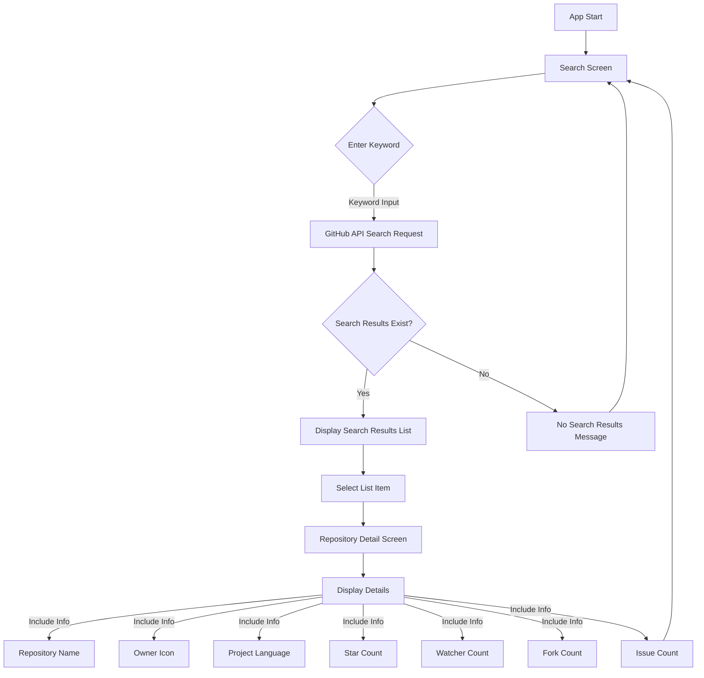

# GitHub リポジトリ検索アプリ

## 主な機能

- キーワード入力によるGitHubリポジトリ検索
- 検索結果リスト表示
- リポジトリ詳細情報の表示

## 画面情報

<table>
  <tr>
    <td colspan="2">
<strong>Prototype image</strong>  この画像は Creatieを使って作成されました。
</td>
  </tr>
  <tr>
    <td>

</td>
  </tr>
</table>

## アプリのフロー

### 検索画面
- キーワード入力
- リポジトリリスト表示

### 詳細情報画面

表示項目:
- リポジトリ名
- 所有者アイコン
- 主要言語
- Star数
- Watcher数
- Fork数
- Issue数
